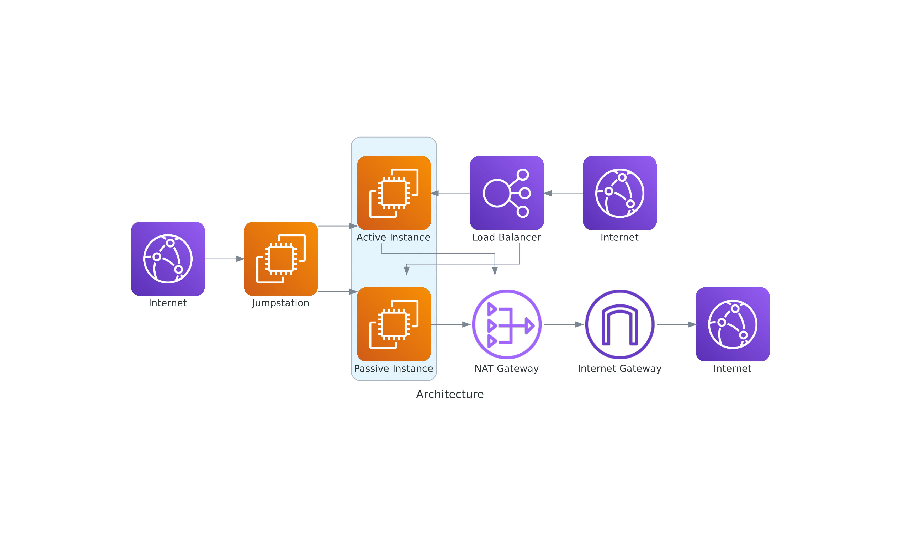

# stateless-web-app-IaC
A terraform AWS infrastructure deployment to host a stateless containerized web application 
 
## Requirements
**Terraform**: 

- Ensure Terraform ``1.11.3`` is installed and configured.

**Service Account Credentials**:

 - Create an IAM User with programmatic access.
 - Generate and securely store``AWS Access Key ID`` and ``Secret Access Key``
 - set credentials under ``./.aws/credentials``.

**Service Account Permissions**

 - The following AWS permissions are required for proper deployment:
  - ``AmazonEC2FullAccess``– Full control over EC2 instances, security groups, and networking.
  - ``AWSCertificateManagerFullAccess`` – Required for managing SSL/TLS certificates in AWS ACM.
  - ``IAMFullAccess`` – Allows managing IAM roles, policies, and permissions needed for infrastructure setup.

**Terrform.tf.vars**:

Adapt if needed the following:
 - ``public_key_path`` apath to the public SSH key file.
 - ``key_path`` apath to the private SSH key file.
 - ``aws_credentials`` path to aws credentials file
 - Public and private Subnets


## Deployment Overview



Below the list of requirements and the measures taken to meet them: 

### 1. Load Balancer for High Availability
- Application is deployed behind an **Application Load Balancer (ALB)**.
- Uses **two public and two private subnets** across different availability zones.

### 2. Secure Network Hosting
- **Security groups** restrict access to only required traffic.
- **EC2 instances** allow inbound traffic only from ALB and SSH access via Bastion.

### 3. Secure SSH Access
- **Bastion host** deployed in a public subnet for controlled SSH access to private EC2 instances.

### 4. Service Accounts & Permissions
- IAM roles and policies are attached to instances for secure AWS resource access.

### 5. Web Application Security
- **HTTPS** enabled via AWS Certificate Manager (ACM).
- (TBC) **Web Application Firewall** for added protection.

### 6. Network Segmentation
- **VPC with public and private subnets**.
- **NAT Gateway** for private subnets to access the internet without exposure.

## How to Deploy
1. **Clone the repository**:
   ```sh
   git clone <repository-url>
   cd <project-directory>
   ```

2. **Configure AWS Credentials** under ./.aws/credentials* (without quotes):
   ```sh
	[default]
	aws_access_key_id = 
	aws_secret_access_key = 

   ```


3. **Update terraform.vartf


4. **Initialize Terraform**:
   ```sh
   terraform init
   ```

5. **Plan the deployment**:
   ```sh
   terraform plan
   ```

6. **Apply the deployment**:
   ```sh
   terraform apply -auto-approve
   ```

7. **Access the Application**:
   - Retrieve the ALB DNS name using:
     ```sh
     terraform output alb_dns_name
     ```
   - Open the DNS name in a browser to access the web app securely over HTTPS.
   - Retrieve the jumpstation public IP:
     ```sh
     terraform output jumpstation_public_ip
     ```   

   - Transfer the private key to the jump station to be able to SSH into the web cluster instances:
     ```sh
     scp -i my-private-key my-private-key ec2-user@<jumpstation address>:/root/.ssh/
     ``` 

   - Access the jumpstation via SSH using the local SSH private key, and from there the EC2 web instances
     ```sh
     ssh -i my-private-key ec2-user@<jumpstation public address>
     ```
   

## Cleanup
To destroy all deployed resources:
```sh
terraform destroy -auto-approve
```

